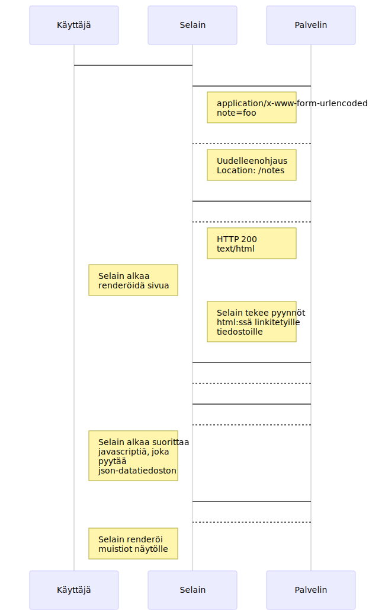
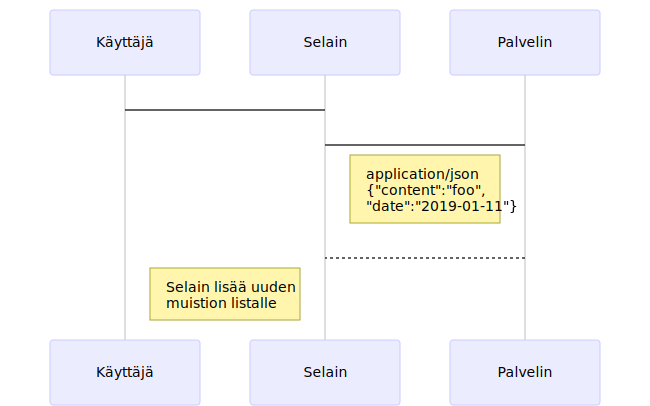

# Osion 0 vastaukset
Sekvenssikaavioiden svg-tiedostojen [mermaid](https://mermaidjs.github.io/)-lähdekoodit löytyvät myös kansiosta
Niitä voi muokkailla esim. vscodella loistavan [Mermaid Preview](https://marketplace.visualstudio.com/items?itemName=vstirbu.vscode-mermaid-preview) -laajennuksen avulla.

**Huom**: http-pyynnöistä on tilankäytöllisistä syistä jätetty palvelimen osoite pois.
Siten kaavioissa esim.  https://fullstack-exampleapp.herokuapp.com/notes on lyhennetty muotoon /notes

## 0.4: Uusi muistiinpano

## 0.5: Single page app

## 0.6: Uusi muistiinpano

